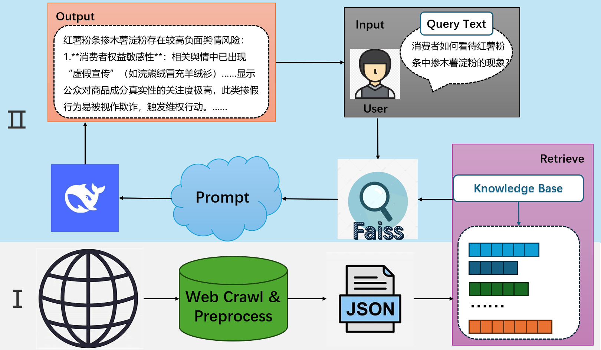

# RAG-PEM
Retrieval-Augmented Generation for Potential Event Mining

<p align='center'>
  
</p>

## Overview 📚
This project focuses on leveraging retrieval-augmented generation (RAG) and prompt engineering to analyze online statements and events, assessing their potential public opinion risks. By integrating historical public opinion data, a domain-specific knowledge base, and large language models (LLMs), the system extracts key viewpoints, measures sentiment intensity, and compares similar past events to aid public opinion analysis.

## Key Features & Implementation ✨

### 1. Data Preprocessing

+ **Collecting the data from [蚁坊软件网站](https://www.eefung.com/yanjiu/).**
+ **1189 pieces of data in total.**

## Codes 🛠️

Before you run the code please register a deepseek or other model's api key and place it in the utils.py file.

### 1_data_acquire.py
Using Web Crawler to crawl the data down and store them into a data1.jsonl file

### 2_text_cut.py
This code file provides two options to process the codes.

### One is only to delete the meaningless information in the raw data like:
+ **舆情分析报告自动生成工具免费试用入口>>> **
+ **相关阅读推荐：舆情简评｜ **
+ **部分文字、图片来自网络，如涉及侵权，请及时与我们联系，我们会在第一时间删除或处理侵权内容。电话：负责人: **

You can choose task = delete to utilize this method.

### The other is to summarize the content in the data by using the LLM
You can choose task = delete to utilize this method.

### 2.5_chunk_paragraph.ipynb
Chunk the texts and encoding them using [all-mpnet-base-v2](all-mpnet-base-v2)

### 3_construct_base.ipynb
+ **Implement a retrieval-augmented generation (RAG) pipeline for public opinion event analysis by leveraging FAISS for efficient text similarity search and SentenceTransformer for embedding generation.**
+ **Build a vector database to store and retrieve relevant texts based on user queries, helping to analyze potential public opinion risks.**
+ **Retrieved texts are incorporated into a structured prompt, which is then sent to an LLM to generate an informed analysis of whether the queried event might escalate into a negative public opinion incident.**

## Package Usage ⚙️
### Requirements 📋
You can quickly install the corresponding dependencies,

```bash
pip install -r requirements.txt
```
## Example 

