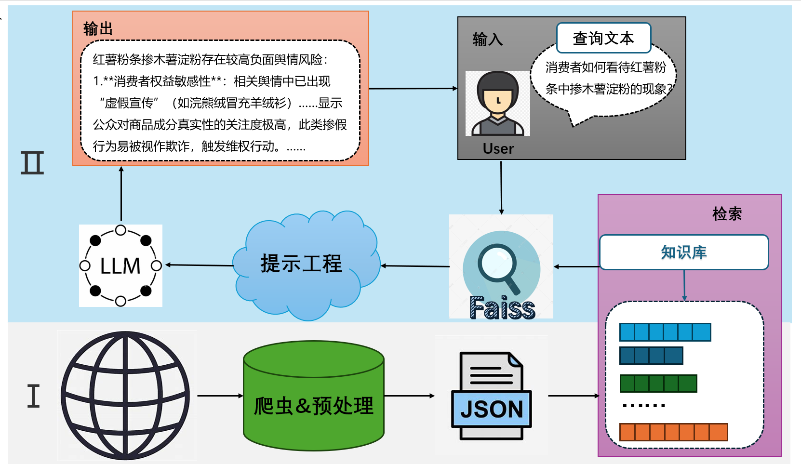
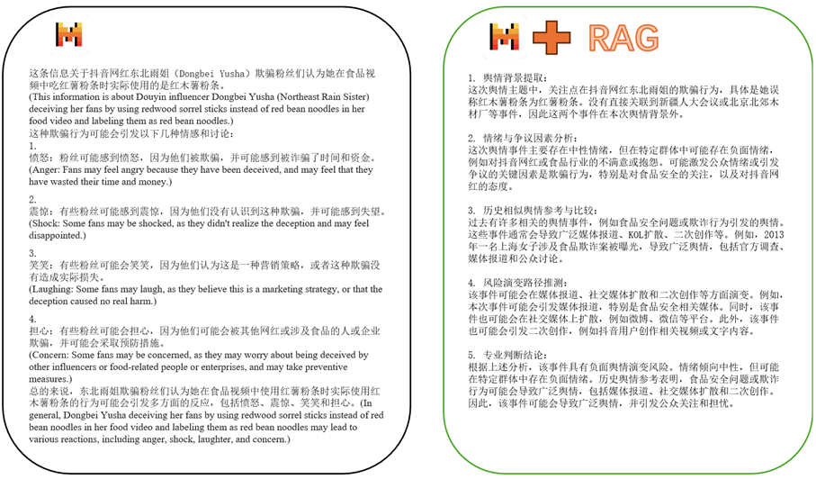

# RAG-PEM
Retrieval-Augmented Generation for Potential Event Mining （基于检索增强生成的潜在舆情事件挖掘）

<p align='center'>
  
</p>

## 概述 📚
本项目设计了一种基于检索增强生成（RAG）的大语言模型辅助舆情事件分析平台，旨在帮助用户分析尚未发酵的舆情，判断其是否具有较强的负面性及其原因。通过爬虫技术和整合现有舆情数据，获取了2023-2025年的舆情信息，确保知识库的时效性。采用基于句子相似度突变的文档分割方法，有效提高了信息独立性，避免了过长文档导致的信息重叠。平台最终实现了通过交互式网页，满足用户的舆情分析与问答需求。

项目组织图如下：

``` bash
├─RAG-PEM
|       ├─1_data_acquire.py
|       ├─2_text_cut.py
|       ├─2_merge_datafile.py
|       ├─2.5_chunk_paragraph.ipynb
|       ├─3_generate_embeddings.py
|       ├─4_question_answer.ipynb
|       ├─utils.py
|       ├─README.md
|       |-requirements.txt
|       ├─backend
|       |  ├─Procfile
|       |  ├─app.py
|       |  ├─utils.py
|       |  └requirements.txt
|       ├─frontend
|       |  ├─index.html
|       |  ├─css
|       |  ├─javascripts
|       |  └......
```

## 数据来源✨

+ **收集来自[蚁坊软件网站](https://www.eefung.com/yanjiu/)与[OpenDataLab](https://opendatalab.com/OpenDataLab/OpenNewsArchive)的数据，共计约5万条.**
+ **在运行代码之前需要先注册一个大语言模型（LLM）的api-key，[火山方舟管理控制台](https://console.volcengine.com/ark/region:ark+cn-beijing/model?vendor=Bytedance&view=LIST_VIEW)，然后把该api-key放在utils.py文件下。**

## 代码 🛠️

### 1_data_acquire.py
本脚本用于批量爬取蚁坊软件网站“研究”栏目下的舆情文章，包括标题、时间、正文和链接，并将结果保存为 JSONL 文件，便于后续的舆情分析或知识库构建。

### 2_text_cut.py
本脚本用于调用大语言模型对来自蚁坊软件网站的舆情文本进行清洗或摘要，支持去除广告等无关信息或提取事件核心内容，并将处理结果保存为 JSONL 文件。

#### 无关信息如下:
+ **舆情分析报告自动生成工具免费试用入口>>> **
+ **相关阅读推荐：舆情简评｜ **
+ **部分文字、图片来自网络，如涉及侵权，请及时与我们联系，我们会在第一时间删除或处理侵权内容。电话：负责人: **

### 2_merge_datafile.py
本脚本用于加载来自OpenDataLab的舆情原始数据，提取正文内容并使用 Sentence-BERT 模型生成向量，结合 process_news 方法完成文本预处理，便于后续相似度计算或下游任务分析

### 2.5_chunk_paragraph.ipynb
分割与编码数据，利用[all-mpnet-base-v2](https://huggingface.co/sentence-transformers/all-mpnet-base-v2)模型编码文本数据

### 3_generate_embeddings.py
本脚本用于对分割后的舆情文本片段批量生成 Sentence-BERT 向量表示，并将每条文本及其对应的向量保存为 JSONL 文件，方便后续用于检索或建库。

### 4_question_answer.ipynb
本脚本实现了一个基于 FAISS 索引的向量数据库，用于存储和搜索文本数据。首先，加载了一个包含文本和嵌入向量的 JSONL 文件，并使用 SentenceTransformer 模型生成文本嵌入。通过 FAISS 构建了一个 L2 距离的向量索引，支持将嵌入向量添加到索引中，并进行基于相似度的检索。检索结果用于生成一个专业的舆情分析提示词，分析是否存在负面舆情的风险。除此之外，还实现了一个自动重试机制用于获取分析结果，最后打印出相关文本及分析结论。

## 项目依赖库下载 ⚙️
### Requirements 📋
通过运行一下命令可以快速完成环境配置：

```bash
pip install -r requirements.txt
```
## Mistral模型对于是否使用RAG的不同回答 📦
<p align='center'>
  
</p>

## 后端与前端实现
